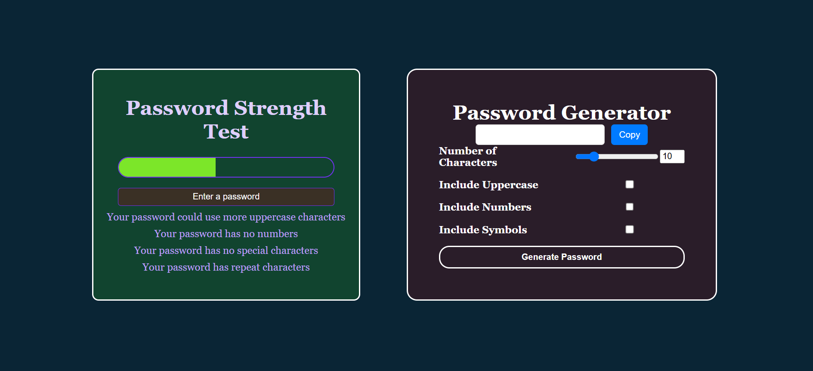

# Password Generator & Strength Tester 🔐

A combined **Password Generator & Strength Tester** built using  **HTML, CSS, and JavaScript** . This tool allows users to generate **strong and secure passwords** and evaluate their strength in real-time. It provides an interactive UI with customizable options and a copy-to-clipboard feature for convenience.

---

## 🚀 Features

✅ **Generate strong passwords** instantly

✅ Customize password length (1-50 characters)

✅ Enable/disable **uppercase letters, numbers, and symbols**

✅ **Password strength meter** with real-time feedback

✅ **Copy to clipboard** functionality for easy use

✅ Responsive & user-friendly UI

---

## 📸 [Live Demo]()



---

## 🛠️ Technologies Used

* **HTML** – Structure of the page
* **CSS** – Styling & animations
* **JavaScript** – Password generation, validation, and strength analysis

---

## 📂 File Structure

```
📁 password-tool
│── 📄 index.html      # Main HTML file
│── 📄 style.css       # Styling for password tool
│── 📄 script.js       # JavaScript logic for password generation & validation
│── 📄 README.md       # Documentation
```

---

## 📜 How It Works

1. **Generate a password** by selecting:
   * Password length (using the range slider or input box)
   * Inclusion of **uppercase letters, numbers, and symbols**
2. The **password strength meter** will analyze the password based on:
   * **Length**
   * **Uppercase & lowercase characters**
   * **Numbers & special symbols**
   * **Repetitive characters**
3. Click the **"Copy"** button to copy the generated password.
4. The **strength meter** dynamically updates to indicate security level.

---

## 🚀 Usage

1. Clone the repository:
   ```sh
   git clone 
   ```
2. Navigate to the project folder:
   ```sh
   cd 
   ```
3. Open `index.html` in your browser.

---

## ⭐ Contributing

Contributions are welcome! Feel free to fork the repository, open issues, or submit pull requests.

---

*If you like this project, give it a ⭐ on GitHub!* 🚀
